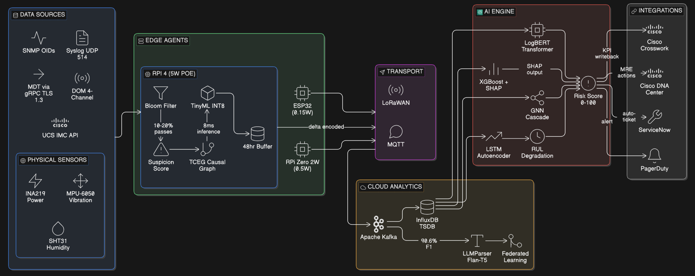
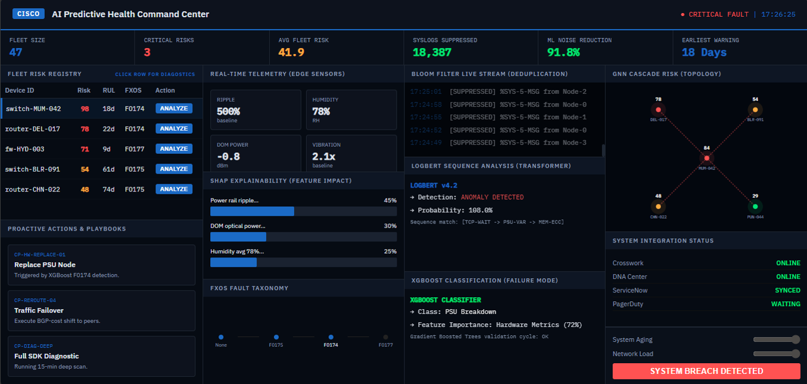

# AI-Driven Predictive and Intelligent Health Monitoring for Hardware Infrastructure

> Cisco NextGen System League (CNSL) 2026 Finalist Project – Team Globetrotter

## Overview

Modern hardware infrastructure often fails due to gradual degradation patterns that remain undetected by traditional threshold-based monitoring systems. Factors such as solder fatigue, capacitor dry-out, PCB corrosion, baseline drift, and thermal runaway can silently impact system health long before a critical failure occurs.

This project proposes an AI-driven predictive health monitoring framework that predicts hardware failures days to weeks in advance by combining telemetry analytics, machine learning, federated learning, and intelligent risk scoring.

The solution is designed as an intelligence augmentation layer that integrates with existing infrastructure management platforms rather than replacing them.

---

## Problem Statement

Current infrastructure monitoring systems face several challenges:

- Reactive failure detection
- Fixed threshold-based alarms
- Underutilized telemetry data
- Diverse deployment environments
- Lack of predictive maintenance capabilities

As enterprise infrastructure ages, these limitations increase downtime, maintenance costs, and operational risks.

---

## Proposed Solution

The proposed framework combines three core capabilities:

### Per-Device Aging Baselines
Each device is evaluated against its own historical behavior instead of fleet-wide averages.

### Environment-Aware Anomaly Detection
Dedicated AI models adapt to deployment conditions such as:

- Data Centers
- Industrial Sites
- Coastal Regions
- High Altitude Locations
- Extreme Temperature Environments

### Multi-Modal Sensor Fusion

The system combines multiple data sources including:

- Power Rail Telemetry
- Temperature Data
- Humidity Sensors
- Vibration Monitoring
- Syslogs
- Existing Cisco Telemetry Streams

---

## System Workflow

1. Telemetry Collection
2. Edge-Level Noise Filtering
3. Feature Extraction
4. AI-Based Analysis
5. Risk Scoring
6. Failure Prediction
7. Recommended Actions

---

## AI/ML Architecture

### CATP (Cascaded Adaptive Telemetry Pipeline)

- Filters 85–95% telemetry noise at the edge
- Reduces unnecessary processing load
- Improves scalability

### Ensemble Intelligence Layer

The proposed architecture combines:

- LogBERT
- XGBoost
- LSTM Autoencoder
- Isolation Forest
- Graph Neural Networks (GNN)

This multi-model approach enables anomaly detection, explainability, topology awareness, and failure prediction.

### Federated Learning

- Privacy-preserving model updates
- Raw telemetry remains on-premises
- Supports distributed infrastructure environments

---

## Risk Scoring Framework

The system generates a dynamic risk score ranging from **0–100**.

The score is aligned with Cisco fault progression patterns and provides:

- Failure likelihood estimation
- Remaining Useful Life (RUL) prediction
- Explainable AI insights
- Recommended mitigation actions

---
## System Architecture

## Dashboard

---
## Expected Benefits

### Operational Impact

- 20% Reduction in MTTR
- 15% Reduction in Unplanned Downtime
- 20% Extension of Asset Lifespan
- 15% Reduction in Maintenance Costs
- Average ROI Ratio of 5:1

### Infrastructure Efficiency

- 80–90% Telemetry Noise Reduction
- 60–80% Bandwidth Savings
- Up to 97% Power Reduction for Tier-3 Deployments
- Significant Reduction in Central Storage Requirements

---

## Technologies

- Machine Learning
- Predictive Analytics
- Edge AI
- Federated Learning
- Graph Neural Networks
- Telemetry Analytics
- Explainable AI
- Infrastructure Monitoring

---

## Team Globetrotter

- **S. Rohith** – CSE (ICB)
- **Siripurapu Manaswi** – CSE
- **R. Shanmukha Siddharth** – ISE

---

## Achievement

🏆 **Cisco NextGen System League (CNSL) 2026 Finalist – Top 6 Team**

Successfully presented the proposed solution during the final showcase round after progressing through a four-week development sprint, knockout rounds, and technical faceoff stages.

---

## Disclaimer

This repository currently contains the project architecture, methodology, research, and competition submission materials developed for Cisco NextGen System League (CNSL) 2026. The repository represents the proposed system design and solution framework presented during the final showcase round.
